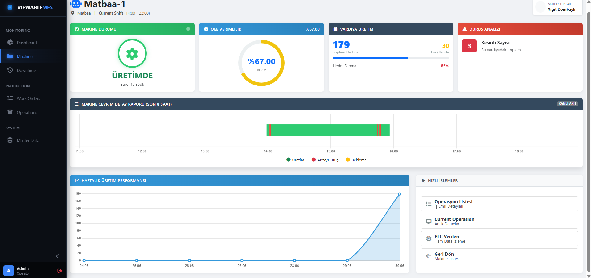
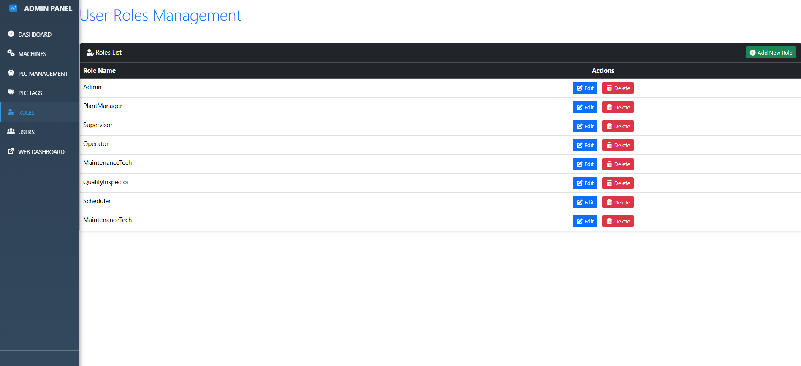
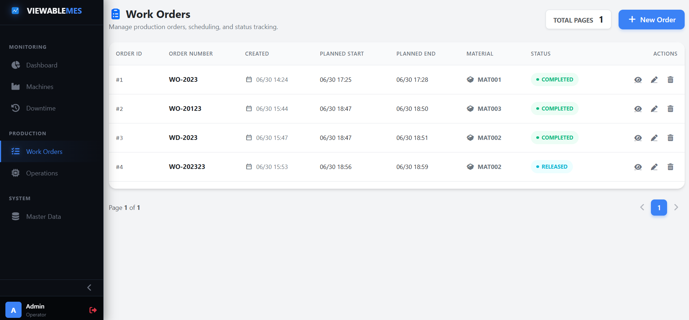
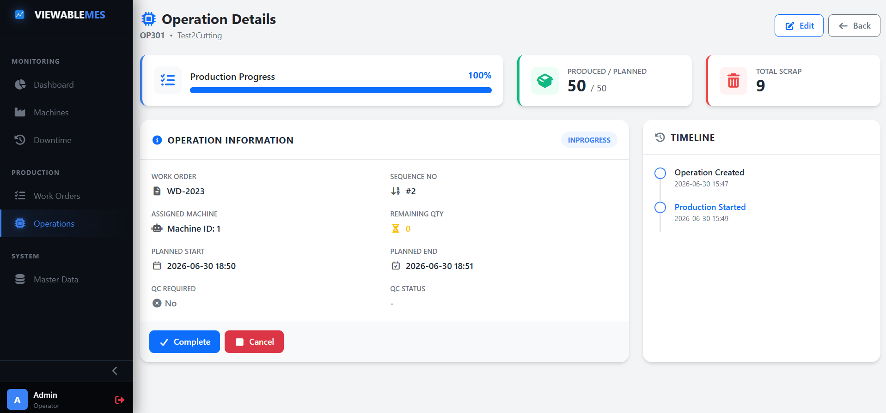
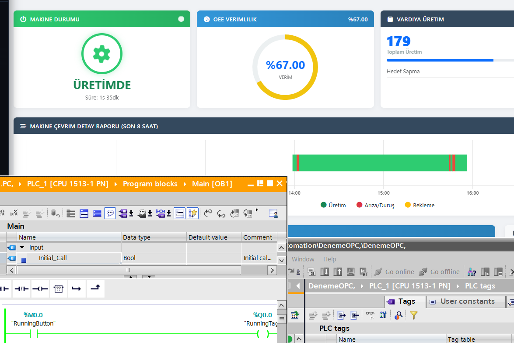
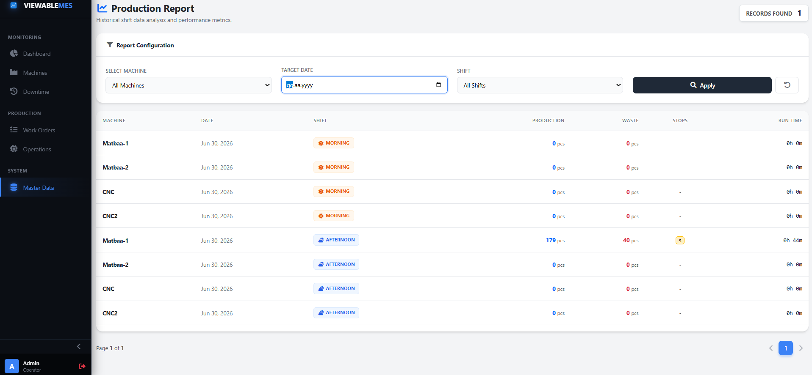

# ViewableMES: Endüstri 4.0 Gerçek Zamanlı Üretim Yürütme ve SCADA Sistemi

Endüstri 4.0'ın getirdiği dijital dönüşüm gereksinimleri, üretim sahalarındaki verilerin anlık olarak izlenmesini, analiz edilmesini ve yönetilmesini zorunlu kılmaktadır. Geliştirilen "ViewableMES" projesi, sahadaki endüstriyel cihazlardan (PLC) OPC UA protokolü aracılığıyla gerçek zamanlı veri toplayan, bu verileri yüksek performanslı zaman serisi veritabanlarında işleyen ve web tabanlı bir arayüz üzerinden kullanıcıya sunan yenilikçi bir Üretim Yürütme Sistemi (MES) ve SCADA platformudur.

## 🎯 Projenin Amacı
* Makine bazlı üretim takibi yapmak.
* OEE (Genel Ekipman Etkinliği) değerlerini anlık hesaplamak.
* İş emirlerini dijital ortama taşımak.
* Plansız duruşları (downtime) minimuma indirmektir.

---

## 🏗 Mimari Tasarım ve Kullanılan Teknolojiler
Proje, ölçeklenebilir ve sürdürülebilir bir yapı sağlamak amacıyla N-Katmanlı (N-Tier) mimari prensiplerine uygun tasarlanmıştır.

### Backend ve Veri Yönetimi Teknolojileri
* **ASP.NET Core 9.0 (MVC & Web API) ve EF Core 9.0:** Temel uygulama iskeleti ve Code-First ORM yapısı.
* **SignalR & OPC UA:** İstemci-sunucu arası anlık veri akışı ve otomasyon cihazlarıyla (PLC) haberleşme.
* **InfluxDB & MS SQL Server:** Yüksek hacimli zaman serisi sensör verileri (InfluxDB) ve ilişkisel sistem verileri (SQL).
* **Background Services:** Veri toplama ve OEE hesaplama gibi asenkron arka plan görevleri.

---

## ⚙️ Temel Modüller ve İşlevler

### 1. Admin Paneli ve Sistem Konfigürasyonları
Sistem yöneticilerinin tesisteki tüm altyapıyı yönettikleri merkezi kontrol noktasıdır.

* **Kullanıcı ve Rol Yönetimi:** Sistem güvenliği ve erişim kontrolü, ASP.NET Core Identity altyapısı kullanılarak detaylı bir rol mimarisiyle kurgulanmıştır. Sistemde PlantManager, Supervisor, Operator, MaintenanceTech, QualityInspector gibi üretim hiyerarşisine uygun roller tanımlanmıştır. Yöneticiler, bu ekran üzerinden kullanıcılara çoklu rol ataması yapabilmekte ve sistem üzerindeki yetki sınırlarını belirleyebilmektedir.
* **Makine ve PLC Yönetimi:** Sahadaki fiziksel makinelerin ve bu makinelere bağlı PLC ünitelerinin dijital ikizlerinin (digital twin) oluşturulduğu bölümdür. Tesis içerisindeki makineler, lokasyon bilgileri ve ID'leri ile sisteme tanımlanır. Makinelerden veri alabilmek için gerekli olan OPC UA Endpoint URL'leri bu arayüzden konfigüre edilir ve bağlantı durumları anlık izlenir. Her bir PLC'den okunacak spesifik adresler sisteme dinamik olarak eklenip çıkarılabilmektedir.

### 2. İş Emri (Work Order) ve Operasyon Yönetimi
Üretim süreçlerinin dijitalleştirilmesi ve planlı bir şekilde yürütülmesi, iş emirleri ve bu emirlere bağlı operasyonların hiyerarşik yönetimi ile sağlanmaktadır.

* **İş Emri Oluşturma ve Takibi:** Üretim planlamasının ilk adımı sisteme yeni bir iş emri (Work Order) tanımlamaktır. İş emirleri listesi ekranında, planlanan üretimlerin başlangıç/bitiş zamanları, kullanılacak hammadde materyalleri ve siparişlerin anlık statüleri şeffaf bir şekilde izlenebilmektedir.
* **Operasyonların Yönetimi ve Makine Atamaları:** İş emirleri oluşturulduktan sonra, bu siparişleri tamamlamak için gereken üretim adımları "Operasyonlar" olarak sisteme girilir. İlgili ekranda tüm operasyonların sıralaması, atandığı makine, planlanan zaman çizelgesi, mevcut durumları ve üretilen/sağlam/fire miktarları özet halinde listelenmektedir. Detay ekranında, seçilen bir operasyonun üretim ilerleme yüzdesi, üretilen ve fire verilen parça sayısı görselleştirilmiştir.

### 3. Gerçek Zamanlı PLC Entegrasyonu (SCADA & TIA Portal)
Sistemin en güçlü yanlarından biri, PLC programı (Siemens TIA Portal) ile web arayüzü arasındaki düşük gecikmeli (low-latency) senkronizasyondur.

* TIA Portal'da yazılan Ladder lojiğindeki bir çıkış sinyali (RunningTag), OPC UA üzerinden OpcUaManager servisiyle okunur ve SignalR vasıtasıyla anında frontend'e iletilir.
* Arayüzdeki "ÜRETİMDE" statüsü doğrudan bu fiziksel sinyale bağlıdır.
* PLC içerisindeki CTU (Counter Up) bloğunda sayılan ürün adedi, milisaniyeler içerisinde MES arayüzündeki vardiya üretim miktarı bölümüne yansımaktadır.
* Veritabanına (InfluxDB) yazma ve ekrana basma işlemleri eşzamanlı yürütülür.

### 4. Üretim Raporlama ve Master Data
Sistemde biriken veriler, yöneticiler için anlamlı raporlara dönüştürülür.

* Master Data modülü altında sunulan Üretim Raporu; makine, tarih ve vardiya (Sabah, Öğle, Akşam vb.) bazlı filtreleme sunar.
* Bu sayede hangi vardiyada ne kadar üretim yapıldığı, kaç adet fire verildiği ve toplam çalışma/duruş süreleri tarihsel olarak analiz edilebilir.

---

## 🚀 Sonuç
Geliştirilen ViewableMES platformu, ASP.NET Core 9'un modern yetenekleri ve InfluxDB/SignalR ikilisinin gücüyle, sahadaki fiziksel otomasyon sistemlerini (TIA Portal PLC'leri) başarılı bir şekilde buluta/web ortamına taşımıştır. Hem yönetimsel (rol ve makine tanımlamaları) hem de operasyonel (iş emri ve anlık SCADA izleme) ihtiyaçları tek bir çatı altında çözen bu N-Katmanlı mimari, dijital fabrika vizyonu için sağlam bir altyapı sunmaktadır.
